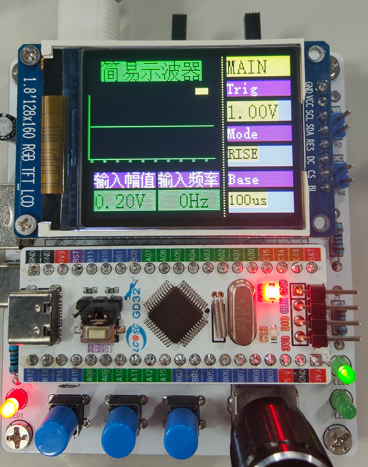

# 简易示波器

一款由GD32E230主控搭建的简易示波器，具备x1、x50倍档切换能力，直流、交流耦合切换能力，可实现较大动态范围、较为精确的波形简易测量，同时具有友好的用户交互菜单界面。本项目基于立创EDA示波器项目。

## 功能介绍

拨动示波器左侧的拨动开关，开启总电源，屏幕亮起，出现欢迎界面，而后进入主界面。

### 示波器接口部分

BNC接头为信号输入，右侧蓝色排针为方波输出管脚（上部为PWM，下部为GND）

### 示波器显示部分

屏幕显示界面分为两部分，左侧为波形测量区，右侧为菜单功能选择区。在左侧波形测量区，中部为波形显示区，下部实时显示输入信号的幅值和输入信号的频率，在上部显示区显示波形触发状态，黄色为未触发，绿色为正常触发状态。

左侧红色LED灯为电源指示灯，右侧两个绿色LED为运行状态指示，上部LED灯亮起为正常采集状态，下部LED灯亮起为停止状态。

### 示波器控制部分

在屏幕上部两个黑色波动开关，左侧为调整AC\DC耦合，右侧为调整x1\x50衰减系数。

在下部三个蓝色的按钮，从左至右功能依次为：RUN\STOP，标尺开关，菜单页面切换。

右侧黑色编码器，旋转可调节菜单选中项，按下黑色编码器选中菜单，左右旋转编码器可调整选中项参数值，再次按下编码器即可保存修改并取消选中。

### 菜单部分

#### 主菜单（MAIN）

共含三项：Trig(设置触发电平)，Mode(信号触发模式)，Base(时基)

##### 触发设置

按下第二个蓝色按钮(KEY2)打卡标线显示可获得更直观的调节显示。

##### 时基

左右旋转旋钮可调节时基大小，时基数值对应左侧中部显示区时间刻度的每一小格（共10格）

注：(Base/10)不能低于ADC采样和处理时间，可通过设置菜单调节ADC采样时间

#### 工具菜单（TOOL）

共含三项：Vmax(信号最高电压)，Cursor(标尺测量功能)，Vmin(信号最低电压)

##### 标尺测量功能

按下第二个蓝色按钮(KEY2)打卡标线显示，并进入Cursor菜单选先后，旋转旋钮可实现波形的测量。

#### PWM输出菜单（PWM）

共含三项：Freq(设置产生方波的频率)，Open(是否开启方波发生器)，Duty(方波占空比)

#### 设置菜单（SET）

共含三项：Dim(信号衰减倍数)，Adc(单片机ADC信号采样时间)，Filter(进入滤波器设置菜单)

##### 信号衰减倍数

与拨码开关倍数调节一致，获得正确的电压显示以及电平触发。

##### ADC信号采样时间

**较短的采样时间**：适用于信号变化较快或要求高转换速率的应用，但可能会对高阻抗信号产生不准确的采样。

**较长的采样时间**：适用于高阻抗信号或需要高精度的应用，有助于提高测量的稳定性和准确性，但会降低 ADC 的转换速率。

| 模式                         | 值   | 采样时间                  |
|:-------------------------- | --- | --------------------- |
| `ADC_SAMPLETIME_1POINT5`   | 0   | 1.5 sampling cycles   |
| `ADC_SAMPLETIME_7POINT5`   | 1   | 7.5 sampling cycles   |
| `ADC_SAMPLETIME_13POINT5`  | 2   | 13.5 sampling cycles  |
| `ADC_SAMPLETIME_28POINT5`  | 3   | 28.5 sampling cycles  |
| `ADC_SAMPLETIME_41POINT5`  | 4   | 41.5 sampling cycles  |
| `ADC_SAMPLETIME_55POINT5`  | 5   | 55.5 sampling cycles  |
| `ADC_SAMPLETIME_71POINT5`  | 6   | 71.5 sampling cycles  |
| `ADC_SAMPLETIME_239POINT5` | 7   | 239.5 sampling cycles |

#### 滤波器设置菜单（FILTER）

共含三项：Avg(均值滤波器窗口大小)，Med(中值滤波器窗口大小)，(PWM)(测量信号占空比)

##### 调整滤波器效果

信号经过ADC采样后，首先经过中值滤波器滤波，然后经过均值滤波器滤波后，存储在示波器中，完成波形显示等功能。

**中值滤波器与均值滤波器功能对比**：

中值滤波器对椒盐噪声更有效，而均值滤波器对高斯噪声效果较好。

中值滤波器能更好地保护边缘细节，而均值滤波器可能导致边缘模糊。

均值滤波器的计算量通常较小，处理速度较快；中值滤波器的计算量较大，但效果更好。

用户可根据信号类型以及处理效果调节滤波器窗口大小（调节至0即为关闭该滤波器），以获得更好的处理效果。

##### 信号占空比测量

进入该选项后，转动旋转编码器，出现"Measuring..."，结束后显示占空比，完成一次占空比的测量。

注：占空比测量前，推荐将均值滤波器关闭（Avg调节为0）,以获得更准确的测量结果

### 频率测量部分

通过动态调节TIM计数器的分频系数可实现1Hz至50kHz频率的测量。连接串口可获得精确的频率测量值

