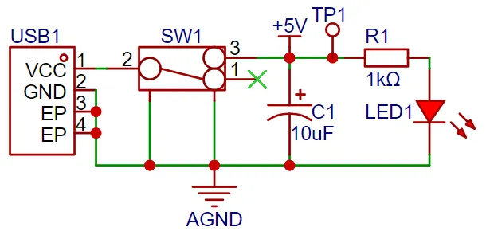

# 简易示波器


一款由GD32E230主控搭建的简易示波器，具备x1、x50倍档切换能力，直流、交流耦合切换能力，可实现较大动态范围、较为精确的波形简易测量，同时具有友好的用户交互菜单界面。本项目基于立创EDA示波器项目。

## 功能介绍


拨动示波器左侧的拨动开关，开启总电源，屏幕亮起，出现欢迎界面，而后进入主界面。

### 示波器接口部分

BNC接头为信号输入，右侧蓝色排针为方波输出管脚（上部为PWM，下部为GND）

### 示波器显示部分

屏幕显示界面分为两部分，左侧为波形测量区，右侧为菜单功能选择区。在左侧波形测量区，中部为波形显示区，下部实时显示输入信号的幅值和输入信号的频率，在上部显示区显示波形触发状态，黄色为未触发，绿色为正常触发状态。

左侧红色LED灯为电源指示灯，右侧两个绿色LED为运行状态指示，上部LED灯亮起为正常采集状态，下部LED灯亮起为停止状态。

### 示波器控制部分

在屏幕上部两个黑色波动开关，左侧为调整AC\DC耦合，右侧为调整x1\x50衰减系数。

在下部三个蓝色的按钮，从左至右功能依次为：RUN\STOP，标尺开关，菜单页面切换。

右侧黑色编码器，旋转可调节菜单选中项，按下黑色编码器选中菜单，左右旋转编码器可调整选中项参数值，再次按下编码器即可保存修改并取消选中。

### 菜单部分

#### 主菜单（MAIN）


共含三项：Trig(设置触发电平)，Mode(信号触发模式)，Base(时基)

##### 触发设置

按下第二个蓝色按钮(KEY2)打卡标线显示可获得更直观的调节显示。


##### 时基

左右旋转旋钮可调节时基大小，时基数值对应左侧中部显示区时间刻度的每一小格（共10格）

注：(Base/10)不能低于ADC采样和处理时间，可通过设置菜单调节ADC采样时间

#### 工具菜单（TOOL）


共含三项：Vmax(信号最高电压)，Cursor(标尺测量功能)，Vmin(信号最低电压)

##### 标尺测量功能

按下第二个蓝色按钮(KEY2)打卡标线显示，并进入Cursor菜单选先后，旋转旋钮可实现波形的测量。


#### PWM输出菜单（PWM）


共含三项：Freq(设置产生方波的频率)，Open(是否开启方波发生器)，Duty(方波占空比)

#### 设置菜单（SET）


共含三项：Dim(信号衰减倍数)，Adc(单片机ADC信号采样时间)，Filter(进入滤波器设置菜单)

##### 信号衰减倍数

与拨码开关倍数调节一致，获得正确的电压显示以及电平触发。

低压档位测量范围：-1.6V-5V，高压档位测量范围：-80V-250V

##### ADC信号采样时间

**较短的采样时间**：适用于信号变化较快或要求高转换速率的应用，但可能会对高阻抗信号产生不准确的采样。

**较长的采样时间**：适用于高阻抗信号或需要高精度的应用，有助于提高测量的稳定性和准确性，但会降低 ADC 的转换速率。

| 模式                         | 值   | 采样时间                  |
|:-------------------------- | --- | --------------------- |
| `ADC_SAMPLETIME_1POINT5`   | 0   | 1.5 sampling cycles   |
| `ADC_SAMPLETIME_7POINT5`   | 1   | 7.5 sampling cycles   |
| `ADC_SAMPLETIME_13POINT5`  | 2   | 13.5 sampling cycles  |
| `ADC_SAMPLETIME_28POINT5`  | 3   | 28.5 sampling cycles  |
| `ADC_SAMPLETIME_41POINT5`  | 4   | 41.5 sampling cycles  |
| `ADC_SAMPLETIME_55POINT5`  | 5   | 55.5 sampling cycles  |
| `ADC_SAMPLETIME_71POINT5`  | 6   | 71.5 sampling cycles  |
| `ADC_SAMPLETIME_239POINT5` | 7   | 239.5 sampling cycles |

#### 滤波器设置菜单（FILTER）


共含三项：Avg(均值滤波器窗口大小)，Med(中值滤波器窗口大小)，(PWM)(测量信号占空比)

##### 调整滤波器效果

信号经过ADC采样后，首先经过中值滤波器滤波，然后经过均值滤波器滤波后，存储在示波器中，完成波形显示等功能。

**中值滤波器与均值滤波器功能对比**：

中值滤波器对椒盐噪声更有效，而均值滤波器对高斯噪声效果较好。

中值滤波器能更好地保护边缘细节，而均值滤波器可能导致边缘模糊。

均值滤波器的计算量通常较小，处理速度较快；中值滤波器的计算量较大，但效果更好。

用户可根据信号类型以及处理效果调节滤波器窗口大小（调节至0即为关闭该滤波器），以获得更好的处理效果。

##### 信号占空比测量

进入该选项后，转动旋转编码器，出现"Measuring..."，结束后显示占空比，完成一次占空比的测量。

注：占空比测量前，推荐将均值滤波器关闭（Avg调节为0）,以获得更准确的测量结果


### 频率测量部分

通过动态调节TIM计数器的分频系数可实现1Hz至50kHz频率的测量。连接串口可获得精确的频率测量值


## 硬件设计

硬件设计主要包含下面四个部分：

1. 模拟前端处理电路：负责将输入的检测模拟信号进行处理后给单片机进行识别，具体电路包括了交直流耦合选择电路、电压衰减电路、信号处理电路以及频率检测电路，是整个电路的核心。

2. 电源电路：负责给运放提供正负电源以及系统供电，是保障电路正常运行的基础；

3. 单片机电路：给系统提供控制核心，负责对输入信号的采集与处理输出工作；

4. 人机交互电路：用于控制示波器功能，包括按键、旋钮、LED灯、显示屏以及其它输入输出接口，为示波器功能的开发提供基础。

#### 模拟前端处理电路

在整个示波器电路设计过程中，模拟前端处理电路是最为重要的，其中大量应用了模拟电路的知识，其中包括输入交直流耦合切换电路、输入信号衰减电路、以及信号调理电路所组成


##### 交直流耦合切换电路

信号类型可以分为直流信号和交流信号，现实中的信号往往都是都不是理想波形。比如直流电源信号应该是一条水平的直流信号，但都会存在电源纹波（交流信号）；在采集交流信号时也可能混入直流信号对波形的峰峰值造成影响。为了保障对输入交流信号的准确测量，利用电容通交隔直的特性，将电容串联到电路中就可以过滤到信号中的直流分量，这就是交流耦合的概念。而直流耦合就是不对输入信号做任何处理。

电路中通过一个拨动开关SW2对输入交直流耦合信号进行切换，当开关2与1接到一起时为直流耦合，当开关2接到3时为交流耦合。那么问题来了，这里的电容该如何取值呢？是不是任意一个电容都行？


要解决这个问题，那就需要了解电容的频率特性，理想状态下隔直电容的选择应该越大越好，但是由于不同容值的自谐振频率不同，低于自谐振频率时电容呈现容性状态，高于该频率时存在感性状态。电容越大，其自谐振频率越低，简单来说就是大电容通低频，小电容通高频。如上右图可知当瓷片电容为0.1uF（100nF）时，其自谐振频率为4Mhz，一般要求电容的截止频率

，其中fo为电路中工作频率。由此可知在该项目中100nF是足够应用的，但如果输入信号频率更高，就应该选择更小的电容。

##### 输入信号衰减电路

信号经过交直流耦合选择电路后由开关SW3选择两个通道，开关2和3接到一起时，输入信号直接流入后级的电压跟随器电路；当开关2和1接到一起时，输入信号经过R7、R11、R14三个电阻构成的电阻分压网络后将信号衰减到了1/50倍，即


结合后面的信号调理电路计算可知：

- 当SW2开关2和3接到一起时，可以测量的输入信号幅值为-1.6V-5V
- 当SW2开关2和1接到一起时，可以测量的输入信号幅值为-80V-250V

由此可知，当输入信号幅值较小时，可优先选择低压档位，如果测量时不确定输入信号幅值可先用高压档位测量后如满足低压范围内，可用低压档位测量以得到更为精准的测量结果，同时保护电路。


补充说明：该项目中使用的探头为BNC转鳄鱼夹探头，非专业示波器探头，仅对电路进行简单分析，此处不进行展开说明更多关于探头选择与阻抗说明。如使用专业示波器的无源探头进行测量，由于探头上有一个x1和x10的档位选择，当档位为x10时可以通过调整探头上的补偿电容或者是电路中的C10进行匹配已得到准确的测量效果，其中C10一般为可调电容，实际大小与各板间电容特性有关。


##### 信号调理电路

**电压跟随器电路**

在电路U5.2芯片中运放反向输入引脚2脚接到运放输出引脚1脚，结合运放的虚短特性，V+=V-=Vout。根据虚断可知运算放大器的输入阻抗比较大，所以运算放大器正向输入电流很小，运放输出阻抗小所以输出的电流很大，说这里的电压跟随器起着一个阻抗匹配的作用。

**比例放大电路**

在对U5.1运放构成的电路进行分析时，可以将其拆解为一个同相比例放大电路和一个反相比例放大电路进行单独分析后合到一起。可得到以下结论：

低压档位测量范围：-1.6V~5V，高压档位测量范围：-80V~250V

##### 比较器测频电路

为了实现频率检测的功能，将ADC输入信号通过一个滞回比较器对输入信号进行比较，实现频率的测量功能。滞回比较器是属于电压比较器中的一种，常规的电压比较器是一个单限比较器，电路中只有一个阈值电压，但在输入电压在阈值附近有微小变化时都会引起输出电压的越变。为了增强电路的抗干扰能力，在单限比较器的基础上引入了正反馈，保障了在一定范围内信号的稳定性。通过滞回比较器电路后输出一个方波信号，使用单片机的定时器捕获功能计算出输入波形的周期大小。


滞回比较器电路的阈值电压需单独对运放输出结果进行分析，当输出为高电平时，输出端上拉到高电平，这时等效电路如下左图所示，算得Uth=U+=2.214V。当运放输出为低电平时，输出端接地，算得Utl=U-=2.172V。

下图绿色线代表信号输入电压变化情况，从0电位上升，初始输出状态为高电平，输入电压达到2.214V时，输出信号变成低电平，直到输入信号低于下限阈值2.172V时输出变为高电平。可以根据比较器当前的输出状态来确定下一个变化电平的阈值，当输出为高电平时使用的是高阈值Uth，输出为低电平时使用低阈值Ttl。之所以将阈值设置接近是为了避免信号干扰造成的误识别。


**注意事项：此处阈值比较器运放正向输入信号为固定电平，若使用带有DAC输出的单片机，可自由配置该点电位大小，从而改变阈值电压，实现对触发模式的设置。在本项目中未方便修改触发电压，使用ADC采样，软件触发模式。**

#### 电源控制电路

该项目使用GD32最小系统板为核心，板载了5V转3.3V降压电路，所以在设计扩展板时只需要设计一个5V电源输入电路即可，这里选用了主流的Type-C为输入接口 ，但需要注意的是这个Type-C接口仅用于供电，不能传输数据，如果需要使用传输数据，可以使用核心板上的Type-C接口。SW1为电源总开关、C1为输入滤波电容，R1是LED1的限流电阻。



除了电源输入电路为，为保障运算放大器对于负电压的测量性能，使用了XD7660负压产生电路得到一个 负电压，该芯片外围电路简单，只需要两个电容和一个二极管即可工作，理论上输入电压为+5V，也可以输出一个-5V的电压，由于芯片内部存在一定压降及转换效率，实际测量负电压为-4.3V左右，也能满足运算放大器的要求。


#### 单片机电路

该项目使用了GD32最小系统板为主控，这款开发板是板载CH340下载芯片，只需要一根数据线就可以对板子进行烧录与串口调试，同时兼容STM32最小系统板的尺寸与引脚配置，可以直接进行替换。


#### 人机交互电路

##### 液晶屏显示电路

1.8 TFT 是一款彩色显示屏，具有 128 x 160 个彩色像素，使用四线SPI通信方式与单片机进行连接，一共有八根引脚，模块引脚说明及与单片机连接情况如下所示：


##### 旋转编码器电路

旋转编码器属于一种特殊的按键，该项目使用的EC11旋转编码器有五个引脚，其中DE两个引脚类似于普通按键引脚，按下导通，松手断开，其余ABC三个引脚用于检测旋钮的转动方向，C脚为公共端，直接接地就行。

在旋转编码器时，A和B两个信号引脚存在相位差，也就是有一个引脚信号变化后另一个引脚信号再跟着变化，即两个引脚不同时变化，通过检测哪个引脚先变就能判断是正转还是反转功能。


##### LED灯指示电路

LED指示电路设计比较简答，采用低电平驱动的方式，当单片机引脚输出为低电平时，LED两端存在电势差，LED点亮；当单片机引脚输出为高电平时，LED灯熄灭。


##### 按键输入检测电路

除了旋转编码器外，该项目还使用了三个独立按键对系统进行控制，三个按键一侧直接接地，另一侧连接到单片机引脚，当单片机引脚检测到按键按下时，单片机引脚直接接到GND接地，单片机收到该引脚接地信号的反馈后再去实现对应的功能，为节约硬件成本，可以在软件设计时引入消抖功能，避免机械按键抖动时的误触发。


##### 其他电路

除了示波器检测功能外，单独引出了一个PWM信号用于模拟一个简易的函数发生器功能，可以通过改变输出PWM的频率和占空比输出一个简易方波信号输出。


## 软件设计


### 滤波器模块

中值滤波算法：中值滤波器通过在图像的每个像素位置上考虑一个邻域区域（通常是一个正方形或矩形窗口），然后用该区域内像素的中值替换该像素的值。中值是将像素值从小到大排序后位于中间位置的值。

```c
int compare(const void *a, const void *b) {
    return (*(uint16_t*)a - *(uint16_t*)b);
}
void medianFilter(uint16_t *input, uint16_t *output, int length, int windowSize) {
		if(windowSize==0){
		    for (int i = 0; i < length; i++) {
					output[i] = input[i];
				}
				return;
	}
    int halfWindow = windowSize / 2;
    uint16_t *window = (uint16_t *)malloc(windowSize * sizeof(uint16_t));
    for (int i = 0; i < length; i++) {
        for (int j = 0; j < windowSize; j++) {
            int index = i + j - halfWindow;
            if (index < 0) index = 0;
            if (index >= length) index = length - 1;
            window[j] = input[index];
        }
        qsort(window, windowSize, sizeof(uint16_t), compare);
        output[i] = window[halfWindow];
    }
		free(window);
}
```

均值滤波算法：均值滤波器通过在图像的每个像素位置上考虑一个邻域区域，然后用该区域内所有像素值的平均值替换该像素的值。

在项目中设计了两种均值滤波算法的函数：avgFilterLazy每到达窗口个数据后才一次平均值，avgFilter只要有新数据就计算平均值。avgFilterLazy有更好的稳定性，avgFilter有更好的实时性，在项目的不同位置根据需要采用适合的函数。

```c
void avgFilterLazy(uint32_t input, uint32_t *window, uint8_t *count, uint32_t *result, uint8_t windowSize) {
	(window)[(*count)] = input;
	(*count) = ((*count) + 1) % windowSize;
	if ((*count) == 0) {
		uint32_t totalDiff = 0;
		for (int i = 0; i < windowSize; i++) {
			totalDiff += (window)[i];			
   }
   (*result) = totalDiff / windowSize;        
   }
			
}
void avgFilter(uint32_t input, uint32_t *window, uint8_t *count, uint32_t *result, uint8_t windowSize) {

    window[*count] = input;
    *count = (*count + 1) % windowSize;
    uint32_t total = 0;
    uint8_t validCount = (*count == 0) ? windowSize : *count;
    for (int i = 0; i < validCount; i++) {
        total += window[i];
    }
    *result = total / validCount;
}
```

### 菜单模块

实现了一个解耦合的菜单框架，只需要实现MENU_OptionTypeDef结构体，就可以轻松的添加一页菜单。结构体中，第一个参数为菜单名，第二个参数为所包含的选项，第三个参数为处理菜单显示内容函数，第四个参数为菜单选择处理函数。

```c
typedef struct _MENU_OptionTypeDef
{
    char *String;
	char* item[3];
    char *(*funcdis)(volatile struct Oscilloscope *value,uint8_t item);
	void (*funchand)(volatile struct Oscilloscope *value,uint8_t key); 	
} MENU_OptionTypeDef;
```

```c
MENU_OptionTypeDef MENU_OptionList[] ={
{"MAIN",{"Trig","Mode","Base"},MENU_DISPLAY_MAIN,MENU_HANDLER_MAIN},
{"TOOL",{"Vmax","Cursor","Vmin"},MENU_DISPLAY_TOOL,MENU_HANDLER_TOOL},
{"PWM",{"Freq","Open","Duty"},MENU_DISPLAY_PWM,MENU_HANDLER_PWM},
{"SET",{"Dim","Adc","Filter"},MENU_DISPLAY_SET,MENU_HANDLER_SET},
{"FILTER",{"Avg","Med","(PWM)"},MENU_DISPLAY_FILTER,MENU_HANDLER_FILTER}
};
```

### ADC采样模块

在ADC滤波部分，将中值滤波器与均值滤波器进行串联，对ADC采集的原始信号进行滤波处理。

```c
void Opt_ADC_Value(uint8_t MedWindowSe,uint8_t AvgWindowSize)
{
    medianFilter(adc_value,filtered1Values,ADC_VALUE_NUM,MedWindowSize);
    avgFilterArray(filtered1Values,filtered2Values,ADC_VALUE_NUM,AvgWindowSize);
}
```

在ADC采样部分，自动连续采样仅有几个挡位可调，采样率变化不连续，故采用外部定时器触发ADC采样，实现采样率的连续惊喜调节。

```c

void ADC_TRIG_TIMMER_Init(){
    //定时器输出参数结构体
	timer_oc_parameter_struct timer_ocinitpara;
	//定时器初始化参数结构体
    timer_parameter_struct timer_initpara;
	//使能定时器0
	rcu_periph_clock_enable(RCU_TIMER0);
	//使能时钟
	rcu_periph_clock_enable(RCU_GPIOA);
	//GPIO复用模式设置--PA2-TIMER14_CH0
	gpio_mode_set(GPIOA, GPIO_MODE_AF, GPIO_PUPD_NONE, GPIO_PIN_4);
	//输出类型设置
	gpio_output_options_set(GPIOA, GPIO_OTYPE_PP, GPIO_OSPEED_50MHZ,GPIO_PIN_4);
	//复用模式0
	gpio_af_set(GPIOA, GPIO_AF_0, GPIO_PIN_4);
	//复位定时器14
	timer_deinit(TIMER0);


	//初始化定时器结构体参数
	timer_struct_para_init(&timer_initpara);
	timer_initpara.prescaler         = 71;									//预分频器参数
	timer_initpara.alignedmode       = TIMER_COUNTER_EDGE;	                //边沿对齐
	timer_initpara.counterdirection  = TIMER_COUNTER_UP;		            //向上计数
	timer_initpara.period            = 9;								//周期
	timer_initpara.clockdivision     = TIMER_CKDIV_DIV1;		            //时钟分频
	timer_initpara.repetitioncounter = 0;								    //重装载值
	timer_init(TIMER0, &timer_initpara);
	
	//初始化定时器通道输出参数结构体
	timer_channel_output_struct_para_init(&timer_ocinitpara);
	timer_ocinitpara.outputstate  = TIMER_CCX_ENABLE;				//输出状态，主输出通道开启
	timer_ocinitpara.outputnstate = TIMER_CCXN_DISABLE;			    //互补输出状态关闭
	timer_ocinitpara.ocpolarity   = TIMER_OC_POLARITY_LOW;	        //输出极性为高
	timer_ocinitpara.ocnpolarity  = TIMER_OCN_POLARITY_LOW;        //互补输出极性为高
	timer_ocinitpara.ocidlestate  = TIMER_OC_IDLE_STATE_HIGH;        //空闲状态通道输出
	timer_ocinitpara.ocnidlestate = TIMER_OCN_IDLE_STATE_HIGH;       //空闲状态互补通道输出
	
	timer_channel_output_config(TIMER0, TIMER_CH_0, &timer_ocinitpara);
	//输出比较值
	timer_channel_output_pulse_value_config(TIMER0, TIMER_CH_0, 2);
	//输出模式0，当计时器小于比较值时，输出有效电平，为高，大于比较器值时输出为低
	timer_channel_output_mode_config(TIMER0, TIMER_CH_0, TIMER_OC_MODE_PWM1);
	//影子模式输出关闭
	timer_channel_output_shadow_config(TIMER0, TIMER_CH_0, TIMER_OC_SHADOW_DISABLE);
	//使能自动重装载
	timer_auto_reload_shadow_enable(TIMER0);
	//配置定时器为主要输出函数，所有通道使能
	timer_primary_output_config(TIMER0, ENABLE);
	timer_enable(TIMER0);	
}
```

通过下面的代码即可修改定时器的溢出值，进而实现对ADC采样时间的控制。

```c
timer_autoreload_value_config(TIMER0,(*value).sampletime);
```

### 频率测量模块

为实现对信号频率的宽范围测量，项目中根据频率的大致范围，动态修改定时器的预分频参数，实现对信号频率的宽范围、精细化测量。

```c
if(oscilloscope.gatherFreq==0){

}else if(oscilloscope.gatherFreq<50){
    if(((uint32_t)TIMER_PSC(TIMER2))!=7199)
        timer_prescaler_config(TIMER2,7199,0);
}else if(oscilloscope.gatherFreq<20000){
    if(((uint32_t)TIMER_PSC(TIMER2))!=71)
        timer_prescaler_config(TIMER2,71,0);
}else{
    if(((uint32_t)TIMER_PSC(TIMER2))!=0)
        timer_prescaler_config(TIMER2,0,0);
}
```

在定时器中，由两类中断，分别为TIMER_INT_FLAG_CH0和TIMER_INT_FLAG_UP即定时器比较中断（在外部端口信号发生变化时触发）和定时器溢出中断（当计数器达到设定值时触发），项目中通过计算溢出终端数计算经过几个计时周期，再加上外部比较中断的时间差，即可获得两次触发的时间间隔，进而可以计算出信号频率。

```c
static __IO uint32_t Value = 0;
static __IO uint8_t ccnumber = 0;
static __IO uint32_t freq = 0;
static __IO uint32_t freqPeriod = 0;
static __IO uint16_t readvalue1 = 0, readvalue2 = 0;
extern volatile struct Oscilloscope oscilloscope;
#define TIMER_FREQUENCY 72000000U //(1 MHz)


#define WINDOW_SIZE 5
volatile uint32_t captureValues[WINDOW_SIZE];
uint8_t captureIndex = 0;
uint32_t avgDiff=10000;


void TIMER2_IRQHandler(void)
{
    if(timer_interrupt_flag_get(TIMER2, TIMER_INT_FLAG_CH0)!= RESET){
        if(0 == ccnumber){
            // 读第一次通道0捕获值
            readvalue1 = timer_channel_capture_value_register_read(TIMER2, TIMER_CH_0);
            ccnumber = 1;
			freqPeriod=0;
        }else if(1 == ccnumber){
            // 读第2次通道0捕获值 
            readvalue2 = timer_channel_capture_value_register_read(TIMER2, TIMER_CH_0);
			Value = ((0xFFFFU*freqPeriod - readvalue1) + readvalue2);
			avgFilter(Value, (uint32_t *)captureValues, (uint8_t *)&captureIndex, (uint32_t *)&avgDiff, WINDOW_SIZE);
			freq = TIMER_FREQUENCY/((uint32_t)TIMER_PSC(TIMER2)+1) / avgDiff;
	        oscilloscope.gatherFreq = freq;						
			ccnumber = 0;												
        }
        timer_interrupt_flag_clear(TIMER2, TIMER_INT_FLAG_CH0);
    }
	

    if (timer_interrupt_flag_get(TIMER2, TIMER_INT_FLAG_UP) != RESET) {
            timer_interrupt_flag_clear(TIMER2, TIMER_INT_FLAG_UP);
            freqPeriod++;
    }
}
```

### 主函数


 ADC数据处理部分流程图如下图


